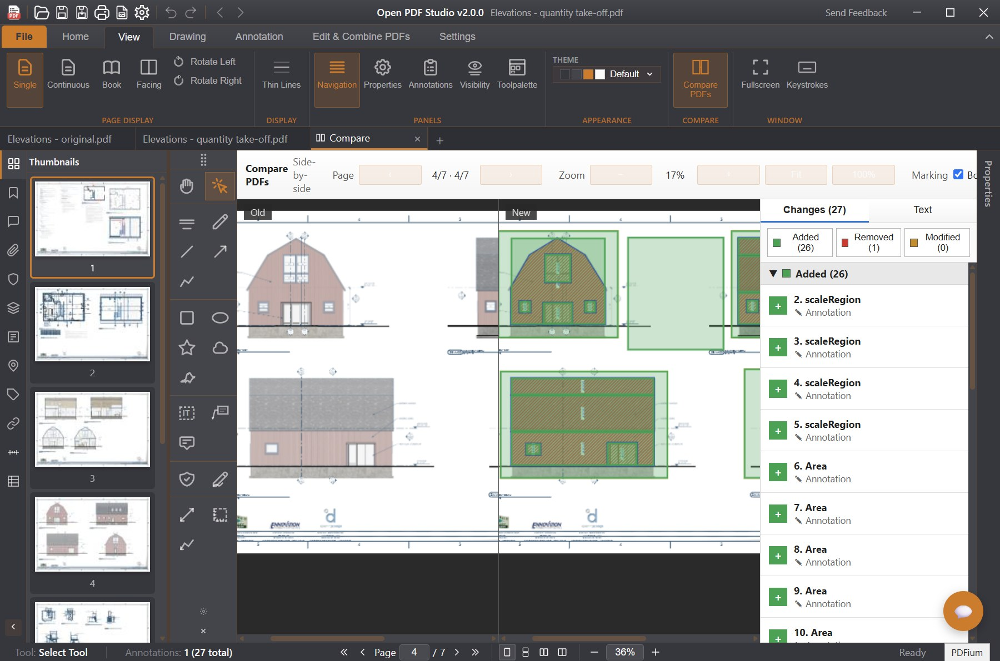
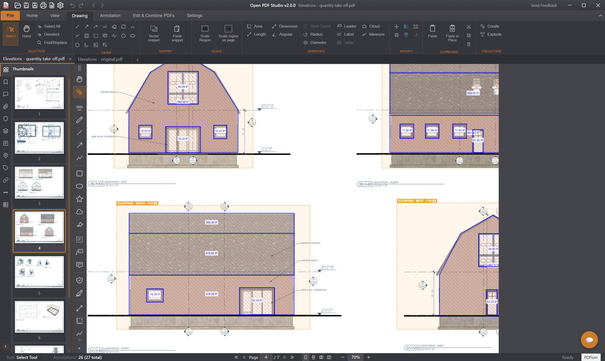

<p align="center">
  
</p>

<h1 align="center">Open PDF Studio</h1>

<p align="center">
  <strong>A free, open-source PDF editor and annotator for Windows, macOS, Linux, and Android.</strong>
</p>

<p align="center">
  <a href="https://github.com/OpenAEC-Foundation/open-pdf-studio/releases/latest"></a>
  <a href="LICENSE.md"></a>
  <a href="https://snapcraft.io/open-pdf-studio"></a>
  <a href="https://github.com/OpenAEC-Foundation/open-pdf-studio/releases"></a>
  <a href="https://github.com/OpenAEC-Foundation/open-pdf-studio/commits"></a>
  <a href="https://github.com/OpenAEC-Foundation/open-pdf-studio/commits"></a>
  <a href="https://github.com/OpenAEC-Foundation/open-pdf-studio/stargazers"></a>
</p>

---

Open PDF Studio is a lightweight, native desktop application that provides professional-grade PDF annotation, markup, and editing tools without subscriptions, telemetry, or bloatware. Built with [Tauri 2](https://tauri.app/) and web technologies, it delivers a fast, modern experience with a Microsoft Office-style ribbon interface.

<p align="center">
  
</p>

<p align="center">
  
</p>

<p align="center">
  
  <br><sub>Parametric walls with self-trimming corners, doors, windows and rooms — drawn to scale on a blank sheet.</sub>
</p>

## Repository activity

Downloads, commit activity, and star growth for this active open-source project.

<p align="center">
  <a href="https://github.com/OpenAEC-Foundation/open-pdf-studio/releases"></a>
  &nbsp;
  <a href="https://github.com/OpenAEC-Foundation/open-pdf-studio/releases/latest"></a>
  &nbsp;
  <a href="https://github.com/OpenAEC-Foundation/open-pdf-studio/commits"></a>
</p>

**Star history**

<p align="center">
  <a href="https://www.star-history.com/?repos=openaec-foundation%2Fopen-pdf-studio&type=date&legend=top-left">
    
  </a>
</p>

<!-- Commit & contributor activity chart: register this repo once at
     https://repobeats.axiom.co, then paste the generated embed here for a
     live commit-history graph:
      -->

## Why Open PDF Studio?

Professional annotation, markup, measurement, redaction and page management — the tools that typical commercial PDF editors lock behind a subscription or a paid tier — are all included, free and fully open source. No subscriptions, no telemetry, no watermarks.

| | Open PDF Studio | Typical commercial PDF editors |
|---|:---:|:---:|
| **Price** | Free & open source (LGPL-3.0) | Subscription or paid license |
| **Annotations & markup** | All included | Often a paid tier |
| **Measurement tools** | Included | Usually paid |
| **Stamps, watermarks & redaction** | Included | Usually paid |
| **Page management** | Included | Usually paid |
| **Multi-tab editing** | Included | Varies |
| **Telemetry** | None | Common |
| **Platforms** | Windows, macOS, Linux, Android | Varies (often fewer) |

## Features

### Annotations & Markup (20+ Tools)
- **Text markup:** Highlight, underline, strikethrough
- **Shapes:** Rectangle, ellipse, polygon, cloud, cloud polyline, line, arrow, polyline
- **Hatch fill patterns:** Cross-hatch, diagonal, dots, and more for shape fills
- **Freehand drawing:** Pen tool with configurable color, width, and opacity
- **Text annotations:** Text box, callout with leader line, sticky notes with popup editing
- **Stamps:** 10 built-in stamps (Approved, Rejected, Draft, Confidential, Final, etc.)
- **Images:** Insert from file, paste from clipboard, or drag-and-drop, with non-destructive cropping
- **Signatures:** Draw multi-stroke signatures, save up to 5 for quick reuse
- **Redaction:** Mark areas and apply to permanently remove content

### Measurement Tools
- Distance, area, and perimeter measurement
- Scale calibration dialog with mm, cm, m, inches, feet, and points
- Per-line scale override, with fallback to the document scale
- Quick scale: right-click a dimension line and type a value (e.g. "12.3m") to recalibrate
- Draggable dimension text and endpoints with live recalculation
- Object snapping to endpoints, midpoints, centers, and edges
- Angle snapping with configurable increments

### PDF Compare
- Compare two PDF revisions in a dedicated compare tab, without leaving your workspace
- Side-by-side and overlay view modes with synchronized scrolling, panning, and zoom
- Automatic change detection classifies differences as added, removed, or modified
- Filterable change list with counts; click a change to jump straight to it
- Manual alignment offset (dx, dy, rotation) to line up drawings that shifted between revisions
- Page-pair navigation for multi-page documents

### Symbol Palettes
- Drag-and-drop symbol libraries onto the page for repetitive markup
- Built-in libraries plus NEN 1414 and Dutch (NL) category sets
- Searchable, collapsible categories; enable or disable groups per project
- Create custom symbol groups saved with your preferences
- Dockable to either side of the canvas or floated freely

### Quantities & Object Counting
- Count tool with named tally categories for on-drawing object counting (takeoff)
- Live quantities schedule that aggregates counts, lengths, and areas
- Grouping, sorting, filtering, subtotals, and grand totals
- Configurable columns, formatting, and table appearance
- Place the generated schedule back onto the page as a table

### Screenshot
- Capture full page or a selected region as an image
- Copy to clipboard or save to file

### Crop Margins
- Auto-detect and trim whitespace around page content

### Text Editing
- Edit existing PDF text content inline
- Add new text annotations with font, size, and color control

### Page Management
- Insert blank pages (standard or custom sizes)
- Delete, extract, and replace pages
- Reorder pages via drag-and-drop thumbnails
- Merge multiple PDFs into one
- Page rotation (90/180/270 degrees)

### Watermarks & Headers/Footers
- Text and image watermarks with opacity, rotation, and position control
- Headers and footers with variables (`{page}`, `{pages}`, `{date}`, `{time}`, `{filename}`)
- Apply to all pages or specific ranges

### Forms
- Fill interactive PDF forms (AcroForms and XFA)
- Create text fields, checkboxes, and radio buttons
- JavaScript validation support

### Printing
- Full print dialog with live preview
- Page range, subset (odd/even), reverse order, copies, and collation
- Scaling: fit to page, actual size, or custom percentage
- Print content: document only, markups only, or both
- Print as image option
- Virtual printer installation (Windows)

### Export
- Export pages as PNG or JPEG (72, 150, 300, 600 DPI)
- Export as raster PDF
- Export/import annotations as XFDF

### Find & Search
- Text search with match case and whole word options
- Highlight all matches with result count
- Navigate results with F3

### Format & Styles
- 12 pre-defined style gallery for quick annotation styling
- Fill color, stroke color, line width, opacity, and border style
- Blend modes for annotation compositing
- Per-annotation-type default styles

### Multi-Select & Alignment
- Select multiple annotations with rubber band or Ctrl+Click
- Shared property editing across selected annotations
- 6-point alignment (left, center, right, top, middle, bottom)
- Horizontal and vertical distribution
- Match size (width, height, or both)
- Flip horizontal/vertical and rotate selected annotations
- Z-order control (bring to front/back, forward/backward)

### Object Snapping
- Snap to endpoints, midpoints, centers, and edges
- Snap to in-progress vertices while drawing polylines and measurements
- Configurable snap radius (3-30px)
- Angle snapping (1-90 degree increments)
- Optional grid overlay with grid snapping

### Tool Palette
- Floating or dockable toolbar with all annotation tools
- Dock to left or right side of the canvas
- Quick access without switching ribbon tabs

### PDF Viewing & Navigation
- High-quality native rendering via a multi-process PDFium worker pool — off the UI thread and crash-isolated, so a bad page never freezes or takes down the app
- Progressive tile rendering for very large CAD drawings: the page and its thumbnails fill in tile-by-tile across the worker pool instead of a seconds-long blank wait
- View modes: single page, continuous scroll, and book (two-page spread, page 1 on the right)
- Zoom: fit page, fit width, actual size, custom percentage, and cursor-anchored mouse-wheel zoom
- Page navigation: first, previous, next, last, go to page
- PDF/A compliance detection with read-only enforcement
- Digital signature validation panel

### Left Panel (10 Tabs)
Thumbnails, Bookmarks, Annotations, Attachments, Digital Signatures, Layers, Form Fields, Named Destinations, Links, Tags

### Bookmarks
- Create, edit, and delete bookmarks
- Hierarchical tree with expand/collapse
- Custom colors and text styling (bold, italic)

### Document Management
- Multi-tab interface for multiple PDFs
- Session save/restore (named workspace snapshots)
- Open PDF from URL
- Bookmarked folder places for quick file access
- Recent files with pin/unpin
- Unsaved changes detection with save prompt
- Document properties dialog
- File locking to prevent external writes

### Ribbon Interface
- Primary tabs: Home, Comment, Drawing, View, Organize, Help
- Contextual tabs: Format and Arrange appear automatically when annotations are selected

### Customization
- **5 themes:** Dark, Light, Blue, High Contrast, System (auto-detect)
- **39 languages** including RTL support:
  [Arabic](https://en.wikipedia.org/wiki/Arabic_language), [Bengali](https://en.wikipedia.org/wiki/Bengali_language), [Bulgarian](https://en.wikipedia.org/wiki/Bulgarian_language), [Catalan](https://en.wikipedia.org/wiki/Catalan_language), [Chinese](https://en.wikipedia.org/wiki/Chinese_language), [Croatian](https://en.wikipedia.org/wiki/Croatian_language), [Czech](https://en.wikipedia.org/wiki/Czech_language), [Danish](https://en.wikipedia.org/wiki/Danish_language), [Dutch](https://en.wikipedia.org/wiki/Dutch_language), [English](https://en.wikipedia.org/wiki/English_language), [Finnish](https://en.wikipedia.org/wiki/Finnish_language), [French](https://en.wikipedia.org/wiki/French_language), [German](https://en.wikipedia.org/wiki/German_language), [Greek](https://en.wikipedia.org/wiki/Greek_language), [Hebrew](https://en.wikipedia.org/wiki/Hebrew_language), [Hindi](https://en.wikipedia.org/wiki/Hindi), [Hungarian](https://en.wikipedia.org/wiki/Hungarian_language), [Indonesian](https://en.wikipedia.org/wiki/Indonesian_language), [Italian](https://en.wikipedia.org/wiki/Italian_language), [Japanese](https://en.wikipedia.org/wiki/Japanese_language), [Korean](https://en.wikipedia.org/wiki/Korean_language), [Malay](https://en.wikipedia.org/wiki/Malay_language), [Norwegian](https://en.wikipedia.org/wiki/Norwegian_language), [Farsi (Persian)](https://en.wikipedia.org/wiki/Persian_language), [Polish](https://en.wikipedia.org/wiki/Polish_language), [Portuguese](https://en.wikipedia.org/wiki/Portuguese_language), [Romanian](https://en.wikipedia.org/wiki/Romanian_language), [Russian](https://en.wikipedia.org/wiki/Russian_language), [Serbian](https://en.wikipedia.org/wiki/Serbian_language), [Slovak](https://en.wikipedia.org/wiki/Slovak_language), [Spanish](https://en.wikipedia.org/wiki/Spanish_language), [Swahili](https://en.wikipedia.org/wiki/Swahili_language), [Swedish](https://en.wikipedia.org/wiki/Swedish_language), [Tamil](https://en.wikipedia.org/wiki/Tamil_language), [Thai](https://en.wikipedia.org/wiki/Thai_language), [Turkish](https://en.wikipedia.org/wiki/Turkish_language), [Ukrainian](https://en.wikipedia.org/wiki/Ukrainian_language), [Urdu](https://en.wikipedia.org/wiki/Urdu), [Vietnamese](https://en.wikipedia.org/wiki/Vietnamese_language)
- Configurable preferences dialog

### Undo/Redo
- Up to 100 levels per document
- Covers annotations, page operations, watermarks, and text edits

### Auto-Update
- Built-in update checker with download progress
- Skip version or remind later options
- Automatic installation and relaunch

## Keyboard Shortcuts

| Shortcut | Action |
|----------|--------|
| `Ctrl+N` | New document |
| `Ctrl+O` | Open file |
| `Ctrl+S` | Save |
| `Ctrl+Shift+S` | Save As |
| `Ctrl+P` | Print |
| `Ctrl+Z` | Undo |
| `Ctrl+Y` / `Ctrl+Shift+Z` | Redo |
| `Ctrl+F` | Find |
| `F3` | Find next |
| `Ctrl+A` | Select all annotations on page |
| `Ctrl+C` / `Ctrl+V` | Copy / Paste annotations |
| `Delete` | Delete selected annotation(s) |
| `Ctrl+D` | Document properties |
| `Ctrl+W` | Close active tab |
| `V` | Select tool |
| `H` | Hand tool |
| `T` | Text box tool |
| `N` | Sticky note tool |
| `Ctrl+=` / `Ctrl+-` | Zoom in / Zoom out |
| `Ctrl+0` | Actual size |
| `Ctrl+1` | Fit width |
| `Ctrl+2` | Fit page |
| `F9` | Toggle navigation panel |
| `F11` | Toggle annotations list |
| `F12` | Toggle properties panel |
| `F1` | Keyboard shortcuts |
| `Arrow keys` | Nudge annotation (1px, Shift for 10px) |
| `Enter` | Complete area/perimeter measurement |

## Installation

### Windows
Download the latest `.exe` installer from [Releases](https://github.com/OpenAEC-Foundation/OpenPDFStudio/releases/latest).

### macOS
Download the latest `.dmg` (universal binary for Intel and Apple Silicon) from [Releases](https://github.com/OpenAEC-Foundation/OpenPDFStudio/releases/latest).

### Linux

**Snap (Ubuntu App Center):**
```bash
sudo snap install open-pdf-studio
```

**Debian/Ubuntu (.deb):**
```bash
sudo dpkg -i open-pdf-studio_*.deb
```

**AppImage:**
```bash
chmod +x open-pdf-studio_*.AppImage
./open-pdf-studio_*.AppImage
```

### Android
Download the APK from [Releases](https://github.com/OpenAEC-Foundation/OpenPDFStudio/releases/latest).

## Building from Source

### Prerequisites
- [Node.js](https://nodejs.org/) 20+
- [Rust](https://www.rust-lang.org/tools/install) (stable)
- [CMake](https://cmake.org/download/) and a C/C++ toolchain
- System dependencies:
  - **Linux:** `libwebkit2gtk-4.1-dev libappindicator3-dev librsvg2-dev patchelf`
  - **macOS:** Xcode Command Line Tools; universal release builds also need the `aarch64-apple-darwin` and `x86_64-apple-darwin` Rust targets
  - **Windows:** Visual Studio Build Tools with C++ workload

### Build

```bash
cd open-pdf-studio
npm ci
npx tauri build
```

The build automatically downloads the pinned macOS PDFium runtime and verifies
its SHA-256 checksum. Build artifacts are written to the workspace-level
`target/release/bundle/` directory, or `target/universal-apple-darwin/release/bundle/`
for a universal macOS build.

### Development

```bash
cd open-pdf-studio
npm ci
npx tauri dev
```

## Tech Stack

| Layer | Technology |
|-------|-----------|
| Desktop framework | [Tauri 2](https://tauri.app/) (Rust backend) |
| UI framework | [SolidJS](https://www.solidjs.com/) |
| Build tool | [Vite](https://vitejs.dev/) |
| Page rendering | Multi-process [PDFium](https://pdfium.googlesource.com/pdfium/) worker pool, with progressive tiling for large drawings |
| Text layer & structure | [PDF.js](https://mozilla.github.io/pdf.js/) |
| PDF manipulation | [pdf-lib](https://pdf-lib.js.org/) |

## Contributing

Contributions are welcome. See [CONTRIBUTING.md](CONTRIBUTING.md) for the full guidelines.

In short: because the codebase moves quickly, a clear, well-described **issue** is usually more valuable than a code pull request — a precise description can be implemented against the *current* code before a branch would go stale.

### Symbol libraries and content — pull requests very welcome

Content is the exception to "prefer issues over PRs". **We want every symbol library in the world.** Symbol sets, hatch patterns, and other reusable content don't go stale the way code does, so **content pull requests are actively encouraged** — bring the standards and libraries from your country, industry, and discipline. Symbols are organised by industry (e.g. AEC) and country (e.g. NL), and localisation will keep expanding, so libraries for any region are welcome.

### We're looking for a content & extensions maintainer

We are looking for someone to **own and maintain the extensions and the content repository** — curating incoming symbol libraries and content contributions, and keeping the ecosystem organised as it grows. If that sounds like you, please open an issue to introduce yourself.

## License

Open PDF Studio is licensed under the [GNU Lesser General Public License v3.0](LICENSE.md).

PDF.js is licensed under the Apache License 2.0. pdf-lib is licensed under the MIT License. PDFium is licensed under the BSD 3-Clause License.
